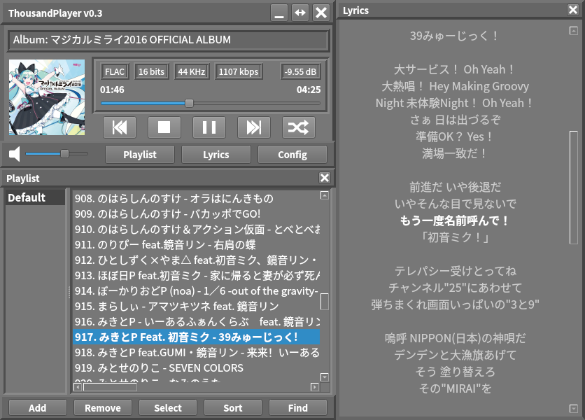
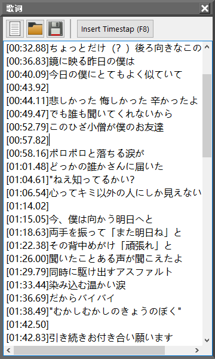
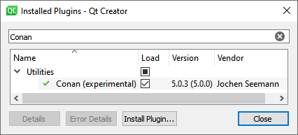
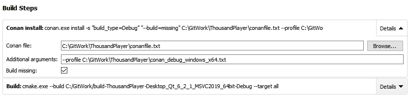

<!--
# Languages of this Page

- **English**
- [日本語](README_ja.md)
- [简体中文](README_zh-CN.md) - [繁體中文](README_zh-TW.md)

---
-->

[](https://github.com/ZXfkSIE/ThousandPlayer/actions/workflows/ubuntu-latest.yml)
[](https://github.com/ZXfkSIE/ThousandPlayer/actions/workflows/windows-2019.yml)

# ThousandPlayer
A Qt6-based open-source audio player developed from scratch. It is a tribute to [TTPlayer (千千静听)](https://zh.wikipedia.org/wiki/千千音乐播放器),
one of the most popular local music players for Microsoft Windows in China during 2000s.

The software is still in early development stage,
but already has fundamental functions that a local audio player should have. Feel free to participate in the development! Here is the [format manual](Format.md) of this project.



## Features
- Cross-platform.
  - Linux and Microsoft Windows (**Windows 10 1809 and above**) are supported at present. Need other developers' help to check the availability in macOS.
- Most UI elements have text with proper font sizes instead of icon-only for the sake of localizability. Current supported UI languages are:
  - en (English)
  - ja (Japanese, 日本語)
  - zh_CN (Simplified Chinese, 简体中文)
  - zh_TW (Traditional Chinese, 繁體中文)
- Currently supports following audio formats:
  - AAC (`.aac`, `.m4a`)
  - ALAC (`.alac`)
  - FLAC (`.flac`)
  - MP3 (`.mp3`)
  - Vorbis (`.ogg`) (only supported in Linux at present. see [QTBUG-99278](https://bugreports.qt.io/browse/QTBUG-99278))
  - WAV (`.wav`)
  - For format support details about ReplayGain and cover art reading, see [here](SupportInfo.md).
- `.lrc` lyrics file viewer.
  - In order to view lyrics, a `.lrc` file must be put in the same directory of the corresponding music file. Also, their filenames must be identical except for the extension part (for example, the lyrics file to be viewed while playing `song.flac` must be named `song.lrc`).
- Integrated `.lrc` lyrics file editor with timestap inserting function.
<p align="center">
  
</p>

- A horizontally expandable main window. No need to worry about long music informations.
- A cover viewer for viewing album covers.
- Rich finding and sorting functions.
- Standard ReplayGain support with pre-amplification and default ReplayGain.
- Customizable fonts of various widgets.
- Playlist persistence and multi-playlist support.
- Multi-threaded file loading.
- CMake-based automatic compilation.

## Planned features
- Audio format converting.
- Music tag editor.
- Audio description customization.
- ReplayGain scanning.
- `.cue` sheet support.
- Streaming audio.

## Serious bugs caused by other libraries
### PipeWire 0.3.40, 0.3.42
- Broken sound after moving playhead in GStreamer applications (including Qt Multimedia, Rhythmbox, etc.). ([report link](https://bugzilla.redhat.com/show_bug.cgi?id=2031441), largely fixed by [version 0.3.43](https://gitlab.freedesktop.org/pipewire/pipewire/-/releases/0.3.43))

### Qt 6.4.0
- [QTBUG-96248](https://bugreports.qt.io/browse/QTBUG-96248): For `QListWidget`, drag & drop function does not work properly when an item is dropped at an inappropriate position.
- [QTBUG-100181](https://bugreports.qt.io/browse/QTBUG-100181): Seeking is buggy while playing **FLAC** files in Windows. This software avoids it by adding a 0.5s delay between file opening and playing. In the future, the backend will be changed to FFmpeg to make the software perfectly cross-platform.

# Compilation Tutorial

This page only provides complation steps with Qt Creator. Of course you can also build it with command lines, Visual Studio or anything else you like.

Before proceeding with the following OS-specific steps, you have to install
- Latest version of Qt Creator.
- Latest version of Qt6 along with Qt Multimedia.
- Latest version of [Conan](https://conan.io/).
- CMake 3.20 or later.
- Other required compilation tools, such as GCC-C++ for Linux, MSVC 2019 for Microsoft Windows, and so on.
- **【Linux】** development packages required by Qt (e.g. libOpenGL) and Qt Multimedia (e.g. libGStreamer).

## Steps
1. Generate Conan profile for the project by running following commands:
```shell
conan profile new thousandplayer --detect
conan profile update settings.compiler.libcxx=libstdc++11 thousandplayer    # Run on Linux
```

2. Turn on Conan plugin in Qt Creator.



3. Open the root `CMakeLists.txt` by Qt Creator,
then configure the project with latest version of Qt6.
The first attempt of CMake configuration should be failed due to the lack of Conan-related scripts, but it's OK.
4. Go to "Projects" tab, raise the existing "Conan install" build step to top of the list, then add the addition argument `--profile thousandplayer` .



5.  Open the root `CMakeLists.txt` in your editor, comment out the 2 Conan-related lines, and save it by CTRL+S to trigger CMake configuration again.
```cmake
if(WIN32)
# In Windows, use Conan to setup 3rd party packages
    message(STATUS "[ThousandPlayer] Windows build environment detected.")
    # include(${CMAKE_BINARY_DIR}/conanbuildinfo.cmake)     # <-- COMMENT OUT!              
    # conan_basic_setup()                                   # <-- COMMENT OUT!
    message(STATUS "[ThousandPlayer] Conan packages loaded: ${CONAN_LIBS}")
```
6. After the end of CMake configuration, the "Build" button with a hammer icon on the bottom left becomes available. Uncomment the 2 lines mentioned above, then you should be able to build it.
