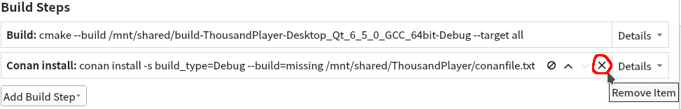

<!--Last update: 2021-11-11 UTC-->
<!--
# Page Languages

- **English**
- [日本語](README_ja.md)
- [简体中文](README_zh-CN.md) - [繁體中文](README_zh-TW.md)

---
-->
# ThousandPlayer
A Qt6-based open-source audio player developed from scratch. It is a tribute to [TTPlayer (千千静听)](https://zh.wikipedia.org/wiki/千千音乐播放器),
one of the most popular local music players for Microsoft Windows in China during 2000s.

The software is still in early development stage,
but already has the basic functions that a local audio player should have. Feel free to participate in the development!


## Features
- Cross-platform.
  - Linux and Microsoft Windows (**Windows 10 1809 and above**) are supported at present. Need other developers' help to check the availability in macOS.
- Most UI elements have text with proper font sizes instead of icon-only for the sake of localizability. Current supported UI languages are:
  - en (English)
  - ja (Japanese, 日本語)
  - zh_CN (Simplified Chinese, 简体中文)
  - zh_TW (Traditional Chinese, 繁體中文)
- Currently supports following audio formats:
  - AAC (`.aac`, `.m4a`)
  - ALAC (`.alac`)
  - FLAC (`.flac`)
  - MP3 (`.mp3`)
  - Vorbis (`.ogg`)
  - WAV (`.wav`)
  - For format support details about ReplayGain and cover art reading, see [here](SupportInfo.md).
- A horizontally expandable main window. No need to worry about long music informations.
- A cover viewer for viewing album covers.
- Rich finding and sorting functions.
- Standard ReplayGain support with pre-amplification and default ReplayGain.
- Customizable fonts of audio infomation label and playlist.
- Multi-threaded file loading.
- CMake-based automatic compilation.

## Planned features
- Playlist persistence and multi-playlist support.
- Viewer and editor for `.lrc` lyrics files.
- Audio format converting function.
- Music tag editor.
- Audio description customization.
- ReplayGain scanning function.
- `.cue` sheet support.
- Streaming audio.

## Current serious bugs caused by Qt
As of Qt 6.2.1.
- [QTBUG-98191](https://bugreports.qt.io/browse/QTBUG-98191): While playing **FLAC** files in Windows, seeking becomes buggy.
- [QTBUG-97758](https://bugreports.qt.io/browse/QTBUG-97758): The output device changing function does not work in Linux.

# Compilation Tutorial

Before these steps, you should install
- Latest version of Qt Creator.
- Latest version of Qt 6.2 (or above versions such as 6.3) along with **Qt Multimedia**.
- CMake 3.20 or above (which can be installed through QT Maintenance Tool).
- Other required compilation tools like GCC, MSVC, Ninja, etc.

## Linux
1. Install required development package (Currently there is only one, i.e. [TagLib](https://taglib.org/)) in your system.
   - For Red Hat distros (RHEL, CentOS, Fedora, etc.), it may be done by `sudo dnf install taglib-devel`.
   - For Debian distros (Debian, Ubuntu, etc.), it may be done by `sudo apt install libtag1-dev`.
2. Use Qt Creator to open the root `CMakeLists.txt`,
then configure the project with Qt 6.2 or above.
   - If you are using Conan plugin in Qt Creator, you may turn off the plugin or remove the "Conan install" build step in "Projects" tab. Conan is not intended to be used in Linux.
3. Build.

## Windows
1. Install [Conan](https://conan.io/downloads.html).
2. Turn on Conan plugin in Qt Creator.


3. Use Qt Creator to open the root `CMakeLists.txt`,
then configure the project with Qt 6.2 or above. The first attempt of CMake configuration should be failed due to the lack of Conan-related scripts, but it's OK.
4. Go to "Projects" tab, raise the "Conan install" build step to the top of the list and add the additional argument `--profile /replace/it/with/project/root/directory/conan_debug_windows_x64.txt` to it.
   - If you are making release build, change the filename to `conan_release_windows_x64.txt`.



5.  Open the root `CMakeLists.txt` in the editor, comment out the 2 Conan-related lines, and save it by CTRL+S to trigger CMake configuration again.
```cmake
if(WIN32)
# In Windows, use Conan to setup 3rd party packages
    message(STATUS "[ThousandPlayer] Windows build environment detected.")
    include(${CMAKE_BINARY_DIR}/conanbuildinfo.cmake)     # <-- COMMENT OUT!              
    conan_basic_setup()                                   # <-- COMMENT OUT!
    message(STATUS "[ThousandPlayer] Conan packages loaded: ${CONAN_LIBS}")
```
6. After the end of CMake configuration, the "Build" button with a hammer icon on the bottom left should become available. Uncomment the 2 lines mentioned above, then you should be able to build it.
